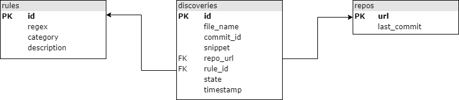

# Credential Digger

Credential Digger is a Github scanning tool that identifies hardcoded credentials (Passwords, API Keys, Secret Keys, Tokens, personal information, etc).
Credential Digger has a clear advantage compared to the other Github scanners in terms of False Positive reduction in the scan reports. 
Credential Digger is using two Machine Learning Models to identify false positives, especially in Password identification:
- Path Model: Identify the portion of code that contains fake credentials used for testing and example purposes (e.g., Unit tests).
- Snippet Model: Identify the portion of code used to authenticate with passwords, and distinguish between real and fake passwords.


## Architecture

Credential Digger finds credentials hardcoded in a repository.
The tool is composed of:
- Postgres database
- Python client
- User interface

### Database

The database is structured in the following way (arrows point to foreign keys).




### Project structure

The project includes 3 components: a db (`sql` folder), a client
(`credentialdigger` folder), and a user interface (`ui` folder).

##### `sql`
`create_table.sql` defines the db schema.

Note that, given the `file_name` and `commit_hash` of a discovery, both the
commit and the file can be accessible at addresses:
```bash
REPO_URL/commit/COMMIT_HASH
REPO_URL/blob/COMMIT_HASH/file_name
```

##### `credentialdigger`
This client can be used to easily interact with the db.
It offers a scanner for git repositories, based on
[Hyperscan](https://www.hyperscan.io/) (others can be implemented).

Please note that the database must be up and running.

##### `ui`
The user interface can be used to easily perform scans and flag the discoveries.


## Install

1. Prepare the `.env` file and edit it with the correct data
   ```bash
   cp .env.sample .env
   vim .env  # Insert real credentials
   ```

2. Run the db and the ui using docker-compose:
   ```bash
   sudo docker-compose up --build
   ```
   Consider not to expose the db port in production.

The ui is available at `http://localhost:5000/`


## Build from scratch

Execute step 1. as above

2. Run the db using docker-compose:
   ```bash
   sudo docker-compose up --build postgres
   ```

3. Install the dependencies for the client.
   ```bash
   sudo apt install libhyperscan-dev libpq-dev
   ```

4. Install the Python requirements from the `requirements.txt` file.
   ```bash
   pip install -r requirements.txt
   ```

5. Install the client
   ```bash
   python setup.py install
   ```

### Pypi

A package is available on pypi. Install the client:
```bash
pip install credentialdigger
```
Please note that the database must be run separately.


### Run the db on a different machine

In case the db and the client are run on different machines, then clone this
repository on both of them.

Then, execute the steps 1. and 2. as described in the installation section
above on the machine running the db, and execute the steps described in the
"build from scratch" section on the machine running the client (or install the
client with `pip`).

In case the db and the client/ui run on separate machines, the port of the db
must be exposed.

In case the UI must be run on a dedicated machine, update the `.env` as needed,
and run:
```bash
sudo docker-compose up --build credential_digger
```


## Use machine learning models

Machine learning models can be downloaded and used to automatically filter
false positive discoveries during a scan.

After installing the client, they can be downloaded as follows.

```bash
# Export the url into an environment variable
export model_name=https://...
# Download and link the model
python -m credentialdigger download model_name
```

If you build the code from scratch (i.e., you don't install the client via
pip), don't run the download command from the installation folder of
_credentialdigger_ in order to avoid errors in linking.

Refer to the Wiki for further information.

### File Path Model
The File Path Model classifies a discovery as false positive according to its file
path when it indicates that the code portion is used for test or exmaple. A pre-trained Path Model [is available here](https://github.com/SAP/credential-digger/releases/download/v1.0.0/path_model-1.0.0.tar.gz).

After installing _credentialdigger_, our pre-trained Path Model can be installed as follows.
```bash
export path_model=https://github.com/SAP/credential-digger/releases/download/v1.0.0/path_model-1.0.0.tar.gz
python -m credentialdigger download path_model
```
### Code Snippet Model

The code Snippet model identifies the password based authentication in a code and differeciate between real and fake passwords. A pre-trained Code Snippet Model [is available here](https://github.com/SAP/credential-digger/releases/download/SM-v1.0.0/snippet_model-1.0.0.tar.gz)

WARNING: This Model is pre-trained with synthetic data in order to protect privacy. It will help to reduce the False Positives related to password recongnition but with a lower precision compared to a Model pre-trained with real data.

### Integrate ML Models in the UI

**ML models are not supported yet in the UI** "out of the box", but they can be
enabled with a little effort.

To use ML models in the docker container running the ui, set their address in
the `.env` file (the Path Model is already set).
If the address is correct, the model will be installed at container building
time.
However, the current server is not executing any model during the scan of a
repository. To enable a model, it must be listed as an argument in the `scan`
function (as would be done in the client).in the `ui/server.py` file.


## Usage (client)

```python
from credentialdigger.cli import Client
c = Client(dbname='MYDB', dbuser='MYUSER', dbpassword='*****',
           dbhost='localhost', dbport=5432)
```


## Wiki
Refer to the [Wiki](https://github.com/SAP/credential-digger/wiki) for further information.


## News
- [Credential Digger announcement](https://blogs.sap.com/2020/06/23/credential-digger-using-machine-learning-to-identify-hardcoded-credentials-in-github)
