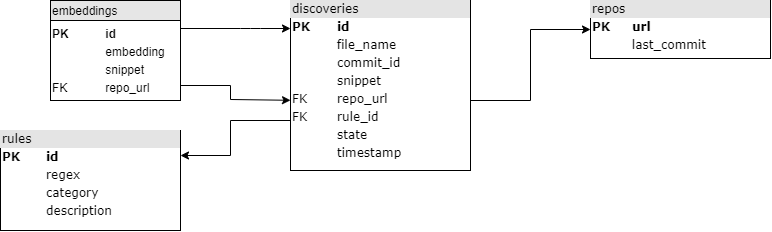

# Credential Digger

Credential Digger is a Github scanning tool that identifies hardcoded credentials (Passwords, API Keys, Secret Keys, Tokens, personal information, etc).
Credential Digger has a clear advantage compared to the other Github scanners in terms of False Positive reduction in the scan reports. 
Credential Digger is using two Machine Learning Models to identify false positivies, especially in Password identification:
- Path Model: Identify the portion of code that contains fake credentials used for testing and example purposes (ex. Unit tests).
- Snippet Model: Identify the portion of code used to authenticate with passwords, and distinguish between real and fake passwords.

## Architecture

Credential Digger finds credentials hardcoded in a repository.
The tool is composed of:
- Postgres database
- Python client
- User interface

### Database

The database is structured in the following way (arrows point to foreign keys).




### Project structure

The project includes 3 components: a db (`sql` folder), a client
(`credentialdigger` folder), and a UI (`ui` folder).

##### `sql`
`create_table.sql` defines the db schema.

Note that, given the `file_name` and `commit_hash` of a discovery, both the
commit and the file can be accessible at addresses:
```bash
REPO_URL/commit/COMMIT_HASH
REPO_URL/blob/COMMIT_HASH/file_name
```

##### `credentialdigger`
This client can be used to easily interact with the db.
It offers a scanner for git repositories, based on
[Hyperscan](https://www.hyperscan.io/) (others can be implemented).

Please note that the database must be up and running.

##### `ui`
The ui can be used to easily perform scans and flag the discoveries.


## Install

1. Prepare the `.env` file and edit it with the correct data
   ```bash
   cp .env.sample .env
   vim .env  # Insert real credentials
   ```

2. Run the db and the ui using docker-compose:
   ```bash
   sudo docker-compose up --build
   ```
   Consider not to expose the db port in production.

The ui is available at http://localhost:5000/

## Build from scratch

Execute step 1. as above

2. Run the db using docker-compose:
   ```bash
   sudo docker-compose up --build postgres
   ```

3. Install the dependencies for the client.
   ```bash
   sudo apt install libhyperscan-dev libpq-dev
   ```
   Install the Python requirements from the `requirements.txt` file.
   ```bash
   pip install -r requirements.txt
   ```

4. Install the client
   ```bash
   python setup.py install
   ```


### Run the db on a different machine

In case the db and the client are run on different machines, then clone this
repository on both of them.

Then, execute the steps 1. and 2. as described in the installation section
above on the machine running the db, and execute the steps described in the
"build from scratch" section on the machine running the client.

In case the db and the client/ui run on separate machines, the port of the db
must be exposed.

In case the ui must be run on a dedicated machine, update the `.env` as needed,
and run:
```bash
sudo docker-compose up --build credential_digger
```


### Use machine learning models

Machine learning models can be downloaded and used to automatically filter
false positive discoveries during a scan.

After installing the client, they can be downloaded as follows.

```bash
# Export the url into an environment variable
export model_name=https://...
# Download and link the model
python -m credentialdigger download model_name
```

NB: Don't run the download command from the installation folder of
credentialdigger in order to avoid errors in linking.

Refer to the Wiki for further information.

**ML models are not supported yet in the ui**

## Usage (client)

```python
from credentialdigger.cli import Client
c = Client(dbname='MYDB', dbuser='MYUSER', dbpassword='*****',
           dbhost='localhost', dbport=5432)
```


## Wiki
Refer to the [Wiki](https://github.com/SAP/credential-digger/wiki) for further information.
